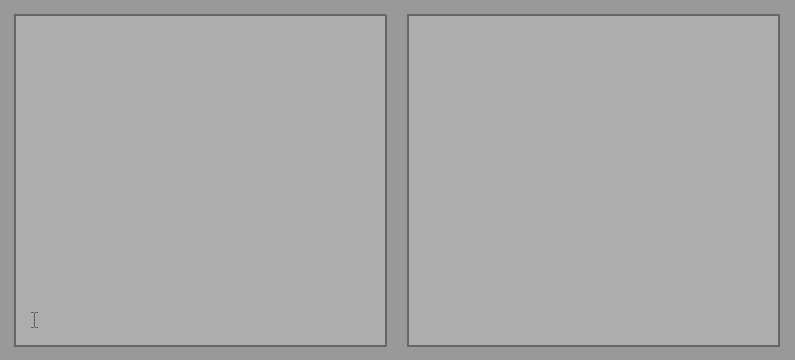

# Tracklist-Number-Remover  
  
  
  
Original name: BonCut  
  
Installation:  
1. [DOWNLOAD RAR](https://github.com/Dark-Gran/Tracklist-Number-Remover/releases/tag/1.1)  
2. Extract  
3. BonCut folder -> BonCut.exe  
  
  
## About Project  
  
Custom-made to be used in an office (administrative).  
Original requirements:  
1. Add "Tracklist:" line on top of the list unless it is already present.  
2. Remove the number (+ dot + space) at the start of each line if present.  
(The input format never changes.)   
  
  
